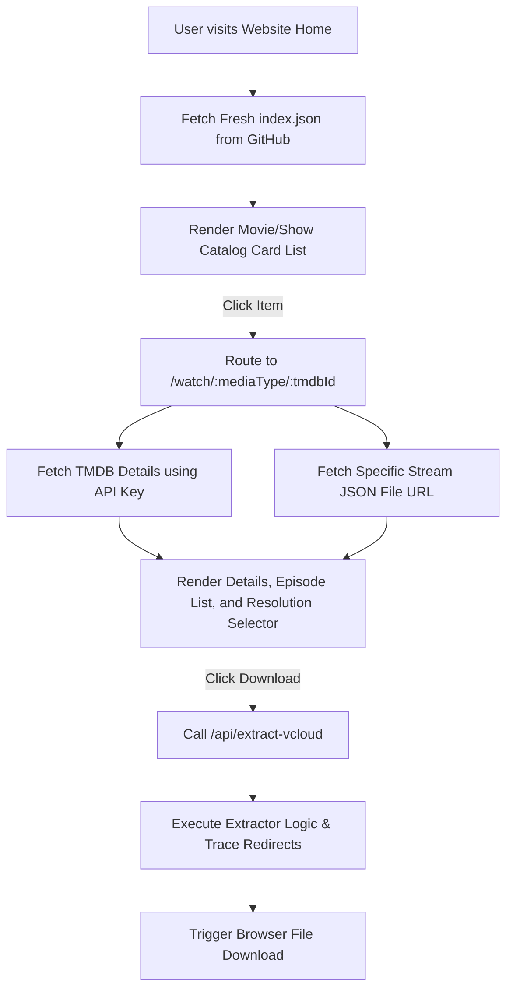

# VCloud Direct Video Extractor & Downloader Integration Guide for Next.js

This document provides a complete, step-by-step implementation plan and source code to build a movie streaming/download website in Next.js, matching the functionality of the mobile app.

It details:
1. **Bypassing CORS**: Running the VCloud extractor server-side via Next.js API Routes.
2. **Main Catalog Index**: Fetching and parsing the project's centralized stream index file fresh on every request.
3. **Dynamic Detail Pages & TMDB Integration**: Pulling rich media info (posters, overviews, episodes) using the TMDB API key.
4. **Locating Stream JSON Files**: Searching or guessing file names in the GitHub repository to load resolution mappings.
5. **Interactive UI**: A premium React component to showcase available download streams and trigger downloads.

---

## 1. Core Architecture



### Key Configurations
* **GitHub Repository URL**: `https://raw.githubusercontent.com/aadil12347/DanieWatch_Apk_Database/main`
* **GitHub API Directory Contents URL**: `https://api.github.com/repos/aadil12347/DanieWatch_Apk_Database/contents/streaming_links`
* **TMDB API Key**: `fc6d85b3839330e3458701b975195487`
* **TMDB API Base URL**: `https://api.themoviedb.org/3`

---

## 2. Fetching and Parsing the Main Catalog Index

The application's single source of truth for all content is a positional JSON index file:
`https://raw.githubusercontent.com/aadil12347/DanieWatch_Apk_Database/main/index.json`

To show new movies immediately, fetch this index file fresh (uncached) from the server.

### Positional Array Format Definition
In the file `index.json`, each entry is an array rather than an object to optimize file size. The items map to fields positionally:
* **Index 0**: TMDB ID (integer)
* **Index 1**: Title (string)
* **Index 2**: Media Type (string, e.g. `'movie'`, `'series'`)
* **Index 3**: Original Language (string)
* **Index 4**: Origin Country (string array)
* **Index 5**: Languages (string array)
* **Index 6**: Genres (string array)
* **Index 7**: IMDB ID (string)
* **Index 8**: Release Date (string, e.g., `'2026-05-15'`)

### Implementation: Loading and Parsing Catalog Index
Create a server utility helper to fetch and parse this file.

#### File: `lib/catalog.ts`
```typescript
export interface CatalogItem {
  id: number;
  title: string;
  mediaType: 'movie' | 'series';
  originalLanguage: string;
  originCountry: string[];
  languages: string[];
  genres: string[];
  imdbId: string | null;
  releaseDate: string | null;
  releaseYear: number | null;
}

const INDEX_URL = 'https://raw.githubusercontent.com/aadil12347/DanieWatch_Apk_Database/main/index.json';

/**
 * Fetches the index.json fresh from GitHub without caching,
 * and parses it into typed CatalogItem objects.
 */
export async function fetchFreshCatalog(): Promise<CatalogItem[]> {
  try {
    const response = await fetch(INDEX_URL, {
      cache: 'no-store', // Force bypass intermediate caches
      headers: {
        'Accept': 'application/json',
      }
    });

    if (!response.ok) {
      throw new Error(`Failed to fetch catalog index. Status: ${response.status}`);
    }

    const rawList: any[] = await response.json();

    return rawList.map((arr: any[]): CatalogItem => {
      // Parse release year
      const releaseDate = arr[8] ? String(arr[8]) : null;
      let releaseYear: number | null = null;
      if (releaseDate && releaseDate.length >= 4) {
        releaseYear = parseInt(releaseDate.substring(0, 4), 10);
      }

      return {
        id: arr[0] ? Number(arr[0]) : 0,
        title: arr[1] ? String(arr[1]) : '',
        mediaType: arr[2] === 'series' ? 'series' : 'movie',
        originalLanguage: arr[3] ? String(arr[3]).trim().toLowerCase() : '',
        originCountry: Array.isArray(arr[4]) ? arr[4].map(String) : [],
        languages: Array.isArray(arr[5]) ? arr[5].map(String) : [],
        genres: Array.isArray(arr[6]) ? arr[6].map(String) : [],
        imdbId: arr[7] ? String(arr[7]) : null,
        releaseDate,
        releaseYear,
      };
    });
  } catch (error) {
    console.error('[Catalog Utility] Error loading catalog index:', error);
    return [];
  }
}
```

---

## 3. Dynamic Watch Detail Page (`/watch/[mediaType]/[id]`)

When a user clicks on a catalog item, navigate to a dynamic detail page. On this page, we fetch the rich media info using TMDB API and lookup the stream links JSON file.

### Step A: Fetching Rich Details from TMDB API
Make server-side requests to TMDB to fetch images, cast, overview, and episodes (for TV shows).

#### File: `lib/tmdb.ts`
```typescript
const TMDB_API_KEY = 'fc6d85b3839330e3458701b975195487';
const TMDB_BASE_URL = 'https://api.themoviedb.org/3';

export interface TMDBMediaDetails {
  title: string;
  overview: string;
  posterPath: string | null;
  backdropPath: string | null;
  releaseDate: string;
  genres: { id: number; name: string }[];
  voteAverage: number;
  seasons?: {
    season_number: number;
    episode_count: number;
    name: string;
  }[];
}

export interface TMDBEpisode {
  episode_number: number;
  name: string;
  overview: string;
  still_path: string | null;
}

export async function fetchTMDBDetails(mediaType: 'movie' | 'series', tmdbId: number): Promise<TMDBMediaDetails | null> {
  const type = mediaType === 'series' ? 'tv' : 'movie';
  const url = `${TMDB_BASE_URL}/${type}/${tmdbId}?api_key=${TMDB_API_KEY}&language=en-US`;

  try {
    const response = await fetch(url, { next: { revalidate: 86400 } }); // Cache TMDB details for 24 hours
    if (!response.ok) return null;
    const data = await response.json();
    return {
      title: data.title || data.name || '',
      overview: data.overview || '',
      posterPath: data.poster_path ? `https://image.tmdb.org/t/p/w500${data.poster_path}` : null,
      backdropPath: data.backdrop_path ? `https://image.tmdb.org/t/p/original${data.backdrop_path}` : null,
      releaseDate: data.release_date || data.first_air_date || '',
      genres: data.genres || [],
      voteAverage: data.vote_average || 0,
      seasons: data.seasons || [],
    };
  } catch (error) {
    console.error('[TMDB API] Error loading details:', error);
    return null;
  }
}

export async function fetchTMDBSeasonEpisodes(tmdbId: number, seasonNumber: number): Promise<TMDBEpisode[]> {
  const url = `${TMDB_BASE_URL}/tv/${tmdbId}/season/${seasonNumber}?api_key=${TMDB_API_KEY}&language=en-US`;
  try {
    const response = await fetch(url, { next: { revalidate: 86400 } });
    if (!response.ok) return [];
    const data = await response.json();
    return (data.episodes || []).map((ep: any) => ({
      episode_number: ep.episode_number,
      name: ep.name,
      overview: ep.overview,
      still_path: ep.still_path ? `https://image.tmdb.org/t/p/w300${ep.still_path}` : null,
    }));
  } catch (error) {
    console.error('[TMDB API] Error loading season episodes:', error);
    return [];
  }
}
```

---

## 4. Resolving Specific Stream JSON Files

Each movie/series has a corresponding JSON file in the GitHub repo `streaming_links` folder containing the VCloud zip page links. The folder holds files named with patterns such as `{title_slug}_{media_type}_{tmdb_id}.json`.

We resolve the correct file URL in two stages:
1. **GitHub Directory Lookup (Preferred)**: Fetch directory contents and cache the file mapping.
2. **Name Pattern Guessing (Fallback)**: Reconstruct file naming standards using string sanitization.

### Implementation: Resolving Stream Link Mappings
Create a resolver helper.

#### File: `lib/stream-resolver.ts`
```typescript
const STREAM_LINKS_BASE = 'https://raw.githubusercontent.com/aadil12347/DanieWatch_Apk_Database/main/streaming_links';
const GITHUB_CONTENTS_API = 'https://api.github.com/repos/aadil12347/DanieWatch_Apk_Database/contents/streaming_links';

// Simple in-memory cache to prevent hitting GitHub API rate limits
let fileMapCache: Map<string, string> | null = null;
let lastCacheTime = 0;

async function refreshFileMapCache(): Promise<Map<string, string>> {
  const fileMap = new Map<string, string>();
  try {
    const response = await fetch(GITHUB_CONTENTS_API, {
      next: { revalidate: 600 } // Cache this list for 10 minutes on Next.js server
    });

    if (response.ok) {
      const files = await response.json();
      const tmdbRegExp = /_(?:movie|series|custom_series)_(\d+)/;
      const imdbRegExp = /(tt\d+)/;

      for (const file of files) {
        const name = file.name || '';
        const downloadUrl = file.download_url || '';
        if (name && downloadUrl) {
          // Index by TMDB ID
          const tmdbMatch = name.match(tmdbRegExp);
          if (tmdbMatch) {
            fileMap.set(`tmdb_${tmdbMatch[1]}`, downloadUrl);
          }
          // Index by IMDB ID
          const imdbMatch = name.match(imdbRegExp);
          if (imdbMatch) {
            fileMap.set(`imdb_${imdbMatch[1]}`, downloadUrl);
          }
        }
      }
    }
  } catch (e) {
    console.error('[Stream Resolver] Failed to fetch directory listing from GitHub', e);
  }
  return fileMap;
}

/**
 * Sanitizes title to replace illegal file path characters with hyphens.
 */
function sanitizeTitle(title: string): string {
  return title
    .replace(/[:/\\*?"<>|]/g, '-')
    .trim();
}

/**
 * Guesses possible file name patterns on GitHub and heads them.
 */
async function checkGuessedFallbacks(title: string, mediaType: 'movie' | 'series', tmdbId: number, releaseYear?: number | null, season?: number): Promise<string | null> {
  const sanitized = sanitizeTitle(title);
  const guesses: string[] = [];

  if (mediaType === 'movie') {
    if (releaseYear) {
      guesses.push(`${sanitized} (${releaseYear})_movie_${tmdbId}.json`);
    }
    guesses.push(`${sanitized}_movie_${tmdbId}.json`);
  } else {
    const sNum = season || 1;
    if (releaseYear) {
      guesses.push(`${sanitized} (Season ${sNum}) (${releaseYear})_series_${tmdbId}.json`);
    }
    guesses.push(`${sanitized} (Season ${sNum})_series_${tmdbId}.json`);
    guesses.push(`${sanitized}_series_${tmdbId}.json`);
  }

  for (const name of guesses) {
    const targetUrl = `${STREAM_LINKS_BASE}/${encodeURIComponent(name)}`;
    try {
      const resp = await fetch(targetUrl, { method: 'HEAD' });
      if (resp.status === 200) {
        return targetUrl;
      }
    } catch {}
  }

  return null;
}

/**
 * Fetches the specific VCloud landing page JSON for a movie or TV show.
 */
export async function getStreamingJsonUrl(
  tmdbId: number,
  mediaType: 'movie' | 'series',
  title: string,
  releaseYear?: number | null,
  imdbId?: string | null,
  seasonNumber?: number
): Promise<string | null> {
  const now = Date.now();
  if (!fileMapCache || now - lastCacheTime > 600000) {
    fileMapCache = await refreshFileMapCache();
    lastCacheTime = now;
  }

  // 1. Direct Directory Cache lookup
  const tmdbKey = `tmdb_${tmdbId}`;
  if (fileMapCache.has(tmdbKey)) {
    return fileMapCache.get(tmdbKey)!;
  }

  if (imdbId) {
    const imdbKey = `imdb_${imdbId}`;
    if (fileMapCache.has(imdbKey)) {
      return fileMapCache.get(imdbKey)!;
    }
  }

  // 2. Guess Pattern Suffix fallback check
  return checkGuessedFallbacks(title, mediaType, tmdbId, releaseYear, seasonNumber);
}

export interface StreamResolutionMap {
  [resolution: string]: string; // e.g. "1080p": "https://vcloud.zip/fwp..."
}

/**
 * Loads the stream resolution map from the resolved JSON file.
 */
export async function fetchStreamLinksMap(streamJsonUrl: string, mediaType: 'movie' | 'series', seasonNumber?: number, episodeNumber?: number): Promise<StreamResolutionMap> {
  const resolutions: StreamResolutionMap = {};
  try {
    const response = await fetch(streamJsonUrl, { cache: 'no-store' });
    if (!response.ok) return resolutions;

    const data = await response.json();

    if (mediaType === 'movie') {
      // Movie format: root keys are resolutions
      for (const res of Object.keys(data)) {
        if (typeof data[res] === 'string' && data[res].startsWith('http')) {
          resolutions[res] = data[res];
        }
      }
    } else {
      // TV Series format: { seasons: { "01": { "1080p": [ { episode_title: "Episode 1", link: "..." } ] } } }
      const seasons = data.seasons;
      if (!seasons || !seasonNumber) return resolutions;

      const paddedSeason = String(seasonNumber).padStart(2, '0');
      let seasonData = seasons[paddedSeason] || seasons[String(seasonNumber)];
      if (!seasonData) return resolutions;

      const epNum = episodeNumber || 1;
      const targetPadded = `Episode ${String(epNum).padStart(2, '0')}`.toLowerCase();
      const targetUnpadded = `Episode ${epNum}`.toLowerCase();

      for (const res of Object.keys(seasonData)) {
        const episodesList = seasonData[res];
        if (Array.isArray(episodesList)) {
          const match = episodesList.find((item: any) => {
            const t = String(item.episode_title || '').toLowerCase();
            return t === targetPadded || t === targetUnpadded;
          });
          if (match && match.link) {
            resolutions[res] = match.link;
          }
        }
      }
    }
  } catch (error) {
    console.error('[Stream Resolver] Error reading resolution map:', error);
  }
  return resolutions;
}
```

---

## 5. Complete Next.js Server-Side API Route (`/api/extract-vcloud`)

Create this API endpoint in your Next.js project. It handles CORS, performs HTML fetching, processes Regex matching, adds time-obfuscated suffixes, and traces redirects on the backend.

### File: `app/api/extract-vcloud/route.ts`

```typescript
import { NextRequest, NextResponse } from 'next/server';

const USER_AGENT = 'Mozilla/5.0 (Windows NT 10.0; Win64; x64) AppleWebKit/537.36 (KHTML, like Gecko) Chrome/120.0.0.0 Safari/537.36';

const AD_KEYWORDS = [
  'bit.ly', 'tinyurl', 'cutt.ly', 'linkvertise', 'adf.ly', 'shorturl',
  'doubleclick', 'popads', 'onclickads', 'exoclick', 'adsterra', 'adlink',
  'winexch', 'lotus', 'bet', 'casino', '1xbet', 'mostbet', 'parimatch',
  'melbet', 'dafanews', 'sportybet', 'betway', 'bet365', 'adsystem',
  'adservices', 'googlesyndication', 'googleadservices'
];

interface ExtractedServers {
  'Server 1'?: string;
  'Server 2'?: string;
  'Server 3'?: string;
}

export async function POST(req: NextRequest) {
  try {
    const { url } = await req.json();

    if (!url || typeof url !== 'string' || !url.startsWith('http')) {
      return NextResponse.json({ error: 'Valid VCloud URL is required' }, { status: 400 });
    }

    console.log(`[VCloud Extractor] Extracting URL: ${url}`);
    
    // Step 1: Fetch Base Landing Page
    const landingPageResponse = await fetch(url, {
      headers: { 'User-Agent': USER_AGENT }
    });

    if (!landingPageResponse.ok) {
      return NextResponse.json({ error: `Failed to load landing page. Status: ${landingPageResponse.status}` }, { status: 502 });
    }

    const html = await landingPageResponse.text();

    // Step 2: Try parsing links directly (in case they are pre-generated)
    let servers = parseServerLinks(html);
    if (servers['Server 1'] || servers['Server 2'] || servers['Server 3']) {
      servers = await resolveRedirectsForServers(servers);
      return NextResponse.json({ success: true, servers });
    }

    // Step 3: Extract intermediate token URL
    let tokenUrl: string | null = null;

    // Regex 3a: Extract from JS variable: var url = '...'
    const varUrlMatch = html.match(/var\s+url\s*=\s*['"](https?:\/\/[^'"]+)['"]/i);
    if (varUrlMatch) {
      tokenUrl = varUrlMatch[1];
    }

    // Regex 3b: Extract from anchor tag with id="download"
    if (!tokenUrl) {
      const aTagRegex = /<a\s+([^>]+)>(.*?)<\/a>/gis;
      let match;
      while ((match = aTagRegex.exec(html)) !== null) {
        const attributes = match[1];
        const innerText = match[2].toLowerCase();
        const idMatch = attributes.match(/id=["']([^"']+)["']/i);
        const id = idMatch ? idMatch[1] : '';

        if (id === 'download' || innerText.includes('generate direct download') || innerText.includes('generate download')) {
          const hrefMatch = attributes.match(/href=["']([^"']+)["']/i);
          if (hrefMatch && hrefMatch[1].startsWith('http')) {
            tokenUrl = hrefMatch[1];
            break;
          }
        }
      }
    }

    // Regex 3c: Extract and decode Base64 URL: url = atob('...')
    if (!tokenUrl) {
      const atobMatch = html.match(/url\s*=\s*atob\(['"]([A-Za-z0-9+/=]+)['"]\)/i);
      if (atobMatch) {
        try {
          tokenUrl = Buffer.from(atobMatch[1], 'base64').toString('utf-8');
        } catch (e) {
          console.error('[VCloud Extractor] Failed to decode base64 URL', e);
        }
      }
    }

    if (!tokenUrl) {
      if (url.includes('token=')) {
        tokenUrl = url;
      } else {
        return NextResponse.json({ error: 'Could not find token URL or download button on page.' }, { status: 404 });
      }
    }

    // Step 4: Fetch Token Page (set Referer header)
    const tokenResponse = await fetch(tokenUrl, {
      headers: {
        'User-Agent': USER_AGENT,
        'Referer': url
      }
    });

    if (!tokenResponse.ok) {
      return NextResponse.json({ error: `Failed to fetch token page. Status: ${tokenResponse.status}` }, { status: 502 });
    }

    const tokenHtml = await tokenResponse.text();

    // Step 5: Parse Server Links & Apply Time Suffixes
    servers = parseServerLinks(tokenHtml);

    // Step 6: Trace redirect chains (HubCloud / GPDL)
    servers = await resolveRedirectsForServers(servers);

    return NextResponse.json({ success: true, servers });

  } catch (error: any) {
    console.error('[VCloud Extractor] API Error:', error);
    return NextResponse.json({ error: error.message || 'Internal Server Error' }, { status: 500 });
  }
}

function parseServerLinks(html: string): ExtractedServers {
  const resolved: ExtractedServers = {};
  const aTagRegex = /<a\s+([^>]+)>(.*?)<\/a>/gis;
  
  const currentMinute = new Date().getMinutes();
  let match;

  while ((match = aTagRegex.exec(html)) !== null) {
    const attributes = match[1];
    const innerHtml = match[2];

    const hrefMatch = attributes.match(/href=["']([^"']+)["']/i);
    if (!hrefMatch) continue;

    const href = hrefMatch[1];
    if (href === '#' || !href) continue;

    const hrefLower = href.toLowerCase();
    
    // Filter non-media endpoints
    if (
      hrefLower.includes('css') || hrefLower.includes('fonts') || 
      hrefLower.includes('favicon') || hrefLower.includes('manifest') || 
      hrefLower.includes('telegram') || hrefLower.includes('t.me') || 
      hrefLower.includes('/tg/') || hrefLower.includes('google.com') ||
      hrefLower.includes('github.com') || hrefLower.includes('admin') ||
      hrefLower.includes('login') || hrefLower.includes('signup') ||
      hrefLower.includes('hubcloud.php')
    ) {
      continue;
    }

    // Filter ads
    if (AD_KEYWORDS.some(keyword => hrefLower.includes(keyword))) continue;

    const idMatch = attributes.match(/id=["']([^"']+)["']/i);
    const id = idMatch ? idMatch[1] : '';

    // Server 1 (FSL): appends '1' + current minute
    if (id === 'fsl' || innerHtml.includes('[FSL Server]')) {
      resolved['Server 1'] = `${href}1${currentMinute}`;
    }
    // Server 2 (FSLv2): appends '_1' + current minute unless cloudflare storage links
    else if (id === 's3' || innerHtml.includes('[FSLv2 Server]')) {
      if (hrefLower.includes('x-amz-signature') || hrefLower.includes('r2.cloudflarestorage') || hrefLower.includes('r2.dev')) {
        resolved['Server 2'] = href;
      } else {
        resolved['Server 2'] = `${href}_1${currentMinute}`;
      }
    }
    // Server 3 (HubCloud)
    else if (
      innerHtml.includes('[Server : 10Gbps]') || 
      hrefLower.includes('pixel.hubcloud') || 
      hrefLower.includes('gpdl') || 
      (hrefLower.includes('hubcloud') && hrefLower.includes('id='))
    ) {
      resolved['Server 3'] = href;
    }
  }

  return resolved;
}

async function resolveRedirectsForServers(servers: ExtractedServers): Promise<ExtractedServers> {
  const result = { ...servers };
  if (result['Server 3']) {
    const directLink = await traceHubCloudRedirect(result['Server 3']);
    if (directLink) {
      result['Server 3'] = directLink;
    }
  }
  return result;
}

async function traceHubCloudRedirect(initialUrl: string): Promise<string | null> {
  let currentUrl = initialUrl;
  let hops = 0;

  while (hops < 10) {
    const urlObj = new URL(currentUrl);
    if (urlObj.searchParams.has('link')) {
      return urlObj.searchParams.get('link');
    }

    const response = await fetch(currentUrl, {
      method: 'GET',
      redirect: 'manual',
      headers: { 'User-Agent': USER_AGENT }
    });

    if (response.status >= 300 && response.status < 400) {
      const location = response.headers.get('location');
      if (location) {
        currentUrl = location.startsWith('http') ? location : new URL(location, currentUrl).toString();
        hops++;
        continue;
      }
    }

    const body = await response.text();
    const jsLocMatch = body.match(/window\.location\s*=\s*['"](https?:\/\/[^'"]+)['"]/i);
    const jsLocHrefMatch = body.match(/window\.location\.href\s*=\s*['"](https?:\/\/[^'"]+)['"]/i);
    const metaRefreshMatch = body.match(/<meta\s+http-equiv=["']refresh["']\s+content=["']\d+;\s*url=([^"']+)["']/i);

    if (jsLocMatch && !jsLocMatch[1].includes('bonuscaf.com') && !jsLocMatch[1].includes('go/')) {
      currentUrl = jsLocMatch[1];
      hops++;
    } else if (jsLocHrefMatch && !jsLocHrefMatch[1].includes('bonuscaf.com') && !jsLocHrefMatch[1].includes('go/')) {
      currentUrl = jsLocHrefMatch[1];
      hops++;
    } else if (metaRefreshMatch) {
      currentUrl = metaRefreshMatch[1];
      hops++;
    } else {
      break;
    }
  }

  try {
    const finalUrlObj = new URL(currentUrl);
    if (finalUrlObj.searchParams.has('link')) {
      return finalUrlObj.searchParams.get('link');
    }
  } catch {}

  return null;
}
```

---

## 6. Client-Side Video Watch & Downloader Component

This components renders movie watch details from TMDB (posters, descriptions, episodes) and exposes direct resolution buttons to fetch and trigger the VCloud extraction.

### File: `components/MediaWatchDetails.tsx`

```tsx
'use client';

import React, { useState, useEffect } from 'react';
import { TMDBMediaDetails, TMDBEpisode } from '@/lib/tmdb';
import { StreamResolutionMap } from '@/lib/stream-resolver';

interface WatchProps {
  tmdbId: number;
  mediaType: 'movie' | 'series';
  title: string;
  releaseYear?: number;
  imdbId?: string;
  initialDetails: TMDBMediaDetails;
}

export default function MediaWatchDetails({
  tmdbId,
  mediaType,
  title,
  releaseYear,
  imdbId,
  initialDetails
}: WatchProps) {
  const [selectedSeason, setSelectedSeason] = useState(1);
  const [selectedEpisode, setSelectedEpisode] = useState(1);
  const [episodes, setEpisodes] = useState<TMDBEpisode[]>([]);
  const [loadingEpisodes, setLoadingEpisodes] = useState(false);

  const [resolutions, setResolutions] = useState<StreamResolutionMap | null>(null);
  const [loadingStreams, setLoadingStreams] = useState(false);

  const [extractedServers, setExtractedServers] = useState<any | null>(null);
  const [extractingServer, setExtractingServer] = useState<string | null>(null);
  const [downloadingServer, setDownloadingServer] = useState<string | null>(null);
  const [error, setError] = useState<string | null>(null);

  // Load episodes when season changes (TV shows only)
  useEffect(() => {
    if (mediaType !== 'series') return;

    async function loadEpisodes() {
      setLoadingEpisodes(true);
      try {
        const res = await fetch(`/api/tmdb-season?tmdbId=${tmdbId}&season=${selectedSeason}`);
        const data = await res.json();
        setEpisodes(data.episodes || []);
      } catch (err) {
        console.error('Failed to load season episodes:', err);
      } finally {
        setLoadingEpisodes(false);
      }
    }
    loadEpisodes();
  }, [selectedSeason, tmdbId, mediaType]);

  // Load streaming resolution links map for selected Movie or TV Episode
  useEffect(() => {
    async function loadStreamLinks() {
      setLoadingStreams(true);
      setResolutions(null);
      setExtractedServers(null);
      setError(null);

      try {
        const episodeQuery = mediaType === 'series' ? `&season=${selectedSeason}&episode=${selectedEpisode}` : '';
        const res = await fetch(
          `/api/resolve-streams?tmdbId=${tmdbId}&mediaType=${mediaType}&title=${encodeURIComponent(title)}&year=${releaseYear || ''}&imdb=${imdbId || ''}${episodeQuery}`
        );
        const data = await res.json();
        if (data.success && data.resolutions) {
          setResolutions(data.resolutions);
        } else {
          setError('No streaming paths found for this selection.');
        }
      } catch (err) {
        setError('Error fetching streaming indexes.');
      } finally {
        setLoadingStreams(false);
      }
    }
    loadStreamLinks();
  }, [selectedSeason, selectedEpisode, tmdbId, mediaType, title, releaseYear, imdbId]);

  const handleExtract = async (vcloudUrl: string, resolutionName: string) => {
    setExtractingServer(resolutionName);
    setError(null);
    setExtractedServers(null);

    try {
      const response = await fetch('/api/extract-vcloud', {
        method: 'POST',
        headers: { 'Content-Type': 'application/json' },
        body: JSON.stringify({ url: vcloudUrl })
      });
      const data = await response.json();
      if (!response.ok || !data.success) {
        throw new Error(data.error || 'Failed to extract video links.');
      }
      setExtractedServers(data.servers);
    } catch (err: any) {
      setError(err.message || 'An error occurred during link extraction.');
    } finally {
      setExtractingServer(null);
    }
  };

  const triggerDownload = (url: string, serverName: string) => {
    setDownloadingServer(serverName);
    try {
      const link = document.createElement('a');
      link.href = url;
      link.setAttribute('download', `${title.replace(/\s+/g, '_')}_${serverName.replace(/\s+/g, '_')}.mp4`);
      link.setAttribute('target', '_blank');
      document.body.appendChild(link);
      link.click();
      document.body.removeChild(link);
    } catch (err) {
      window.open(url, '_blank');
    }
    setTimeout(() => setDownloadingServer(null), 3000);
  };

  return (
    <div className="watch-page-container">
      {/* Backdrop Section */}
      <div 
        className="backdrop-banner" 
        style={{ backgroundImage: initialDetails.backdropPath ? `url(${initialDetails.backdropPath})` : 'none' }}
      >
        <div className="backdrop-overlay" />
      </div>

      <div className="content-grid">
        {/* Poster Info */}
        <div className="meta-card">
          {initialDetails.posterPath && (
            // eslint-disable-next-line @next/next/no-img-element
            
          )}
          <h1 className="title-text">{title}</h1>
          <div className="meta-row">
            <span className="rating-badge">★ {initialDetails.voteAverage.toFixed(1)}</span>
            <span className="year-text">{releaseYear}</span>
            <span className="type-badge">{mediaType.toUpperCase()}</span>
          </div>
          <p className="overview-text">{initialDetails.overview}</p>
        </div>

        {/* Streaming & Episode Selector */}
        <div className="details-card">
          {mediaType === 'series' && (
            <div className="episode-selector-section">
              <h2 className="card-heading">Select Season & Episode</h2>
              <div className="dropdowns-row">
                <select 
                  value={selectedSeason} 
                  onChange={(e) => {
                    setSelectedSeason(Number(e.target.value));
                    setSelectedEpisode(1);
                  }}
                  className="theme-dropdown"
                >
                  {initialDetails.seasons?.map(s => (
                    <option key={s.season_number} value={s.season_number}>
                      {s.name || `Season ${s.season_number}`}
                    </option>
                  ))}
                </select>

                <select 
                  value={selectedEpisode} 
                  onChange={(e) => setSelectedEpisode(Number(e.target.value))}
                  className="theme-dropdown"
                  disabled={loadingEpisodes}
                >
                  {episodes.map(ep => (
                    <option key={ep.episode_number} value={ep.episode_number}>
                      Episode {ep.episode_number}: {ep.name}
                    </option>
                  ))}
                </select>
              </div>
            </div>
          )}

          {/* Resolutions Selector */}
          <div className="resolutions-section">
            <h2 className="card-heading">Choose Resolution</h2>
            {loadingStreams ? (
              <div className="pulse-skeleton">Loading available resolutions...</div>
            ) : error ? (
              <div className="error-card">{error}</div>
            ) : resolutions && Object.keys(resolutions).length > 0 ? (
              <div className="resolutions-grid">
                {Object.entries(resolutions).map(([resolution, vcloudUrl]) => (
                  <button
                    key={resolution}
                    onClick={() => handleExtract(vcloudUrl, resolution)}
                    className={`resolution-btn ${extractingServer === resolution ? 'btn-active' : ''}`}
                    disabled={!!extractingServer}
                  >
                    {extractingServer === resolution ? (
                      <span className="spinner-inline">Resolving {resolution}...</span>
                    ) : `Download in ${resolution}`}
                  </button>
                ))}
              </div>
            ) : (
              <div className="info-card">No download resolutions listed for this file.</div>
            )}
          </div>

          {/* Extraction Links Output */}
          {extractedServers && (
            <div className="extraction-output">
              <h2 className="card-heading">Direct Server Downloads</h2>
              <div className="servers-list">
                {Object.entries(extractedServers).map(([serverName, url]: any) => (
                  <div key={serverName} className="server-item">
                    <span className="server-label">{serverName}</span>
                    <button
                      onClick={() => triggerDownload(url, serverName)}
                      className={`trigger-download-btn ${downloadingServer === serverName ? 'downloading' : ''}`}
                    >
                      {downloadingServer === serverName ? 'Starting Download...' : 'Download File'}
                    </button>
                  </div>
                ))}
              </div>
            </div>
          )}
        </div>
      </div>

      <style jsx global>{`
        .watch-page-container {
          min-height: 100vh;
          background: #090c15;
          color: #ffffff;
          font-family: 'Inter', system-ui, sans-serif;
          position: relative;
          padding-bottom: 5rem;
        }

        .backdrop-banner {
          height: 40vh;
          background-size: cover;
          background-position: center;
          position: relative;
          z-index: 1;
        }

        .backdrop-overlay {
          position: absolute;
          inset: 0;
          background: linear-gradient(to bottom, transparent 0%, #090c15 100%);
        }

        .content-grid {
          position: relative;
          z-index: 2;
          margin-top: -10vh;
          display: grid;
          grid-template-columns: 350px 1fr;
          gap: 2.5rem;
          max-width: 1200px;
          margin-left: auto;
          margin-right: auto;
          padding: 0 1.5rem;
        }

        .meta-card {
          background: rgba(17, 22, 38, 0.8);
          border: 1px solid rgba(255, 255, 255, 0.08);
          border-radius: 20px;
          padding: 2rem;
          backdrop-filter: blur(12px);
          height: fit-content;
        }

        .poster-img {
          width: 100%;
          border-radius: 12px;
          box-shadow: 0 12px 24px rgba(0, 0, 0, 0.5);
          margin-bottom: 1.5rem;
        }

        .title-text {
          font-size: 1.75rem;
          font-weight: 800;
          margin: 0 0 1rem 0;
          background: linear-gradient(135deg, #fff 0%, #93c5fd 100%);
          -webkit-background-clip: text;
          -webkit-text-fill-color: transparent;
        }

        .meta-row {
          display: flex;
          gap: 0.75rem;
          align-items: center;
          margin-bottom: 1.5rem;
        }

        .rating-badge {
          background: rgba(234, 179, 8, 0.2);
          border: 1px solid #eab308;
          color: #fef08a;
          padding: 0.25rem 0.5rem;
          border-radius: 6px;
          font-weight: 700;
          font-size: 0.85rem;
        }

        .year-text {
          color: #94a3b8;
        }

        .type-badge {
          background: rgba(59, 130, 246, 0.2);
          border: 1px solid #3b82f6;
          color: #93c5fd;
          padding: 0.25rem 0.5rem;
          border-radius: 6px;
          font-weight: 600;
          font-size: 0.85rem;
        }

        .overview-text {
          color: #94a3b8;
          line-height: 1.6;
          font-size: 0.95rem;
          margin: 0;
        }

        .details-card {
          background: rgba(17, 22, 38, 0.8);
          border: 1px solid rgba(255, 255, 255, 0.08);
          border-radius: 20px;
          padding: 2.5rem;
          backdrop-filter: blur(12px);
          display: flex;
          flex-direction: column;
          gap: 2.5rem;
        }

        .card-heading {
          font-size: 1.25rem;
          font-weight: 700;
          margin: 0 0 1.25rem 0;
          letter-spacing: -0.015em;
        }

        .dropdowns-row {
          display: flex;
          gap: 1rem;
        }

        .theme-dropdown {
          background: rgba(9, 12, 21, 0.8);
          border: 1px solid rgba(255, 255, 255, 0.1);
          color: white;
          padding: 1rem;
          border-radius: 12px;
          font-size: 1rem;
          flex: 1;
          outline: none;
          cursor: pointer;
        }

        .theme-dropdown:focus {
          border-color: #3b82f6;
        }

        .resolutions-grid {
          display: grid;
          grid-template-columns: repeat(auto-fill, minmax(200px, 1fr));
          gap: 1rem;
        }

        .resolution-btn {
          padding: 1rem;
          background: rgba(255, 255, 255, 0.04);
          border: 1px solid rgba(255, 255, 255, 0.08);
          color: white;
          border-radius: 12px;
          font-size: 1rem;
          font-weight: 600;
          cursor: pointer;
          transition: all 0.2s ease;
        }

        .resolution-btn:hover {
          background: white;
          color: #090c15;
          transform: translateY(-2px);
        }

        .pulse-skeleton {
          padding: 1.5rem;
          background: rgba(255, 255, 255, 0.03);
          border-radius: 12px;
          text-align: center;
          color: #94a3b8;
          animation: pulse 1.5s infinite;
        }

        .error-card {
          padding: 1rem 1.25rem;
          border: 1px solid rgba(239, 68, 68, 0.2);
          background: rgba(239, 68, 68, 0.08);
          color: #fca5a5;
          border-radius: 12px;
        }

        .extraction-output {
          background: rgba(9, 12, 21, 0.5);
          border: 1px solid rgba(255, 255, 255, 0.05);
          border-radius: 16px;
          padding: 1.5rem;
          animation: slideDown 0.3s ease;
        }

        .servers-list {
          display: flex;
          flex-direction: column;
          gap: 0.75rem;
        }

        .server-item {
          display: flex;
          align-items: center;
          justify-content: space-between;
          padding: 0.75rem 1rem;
          background: rgba(255, 255, 255, 0.02);
          border-radius: 10px;
          border: 1px solid rgba(255, 255, 255, 0.04);
        }

        .server-label {
          font-weight: 600;
        }

        .trigger-download-btn {
          padding: 0.5rem 1rem;
          background: #3b82f6;
          border: none;
          color: white;
          border-radius: 8px;
          font-weight: 600;
          cursor: pointer;
          transition: all 0.2s ease;
        }

        .trigger-download-btn:hover {
          background: #2563eb;
        }

        .trigger-download-btn.downloading {
          background: #10b981;
        }

        @keyframes pulse {
          0%, 100% { opacity: 0.6; }
          50% { opacity: 1; }
        }

        @keyframes slideDown {
          from { opacity: 0; transform: translateY(-10px); }
          to { opacity: 1; transform: translateY(0); }
        }

        @media (max-width: 900px) {
          .content-grid {
            grid-template-columns: 1fr;
            margin-top: -5vh;
          }
          .backdrop-banner {
            height: 30vh;
          }
        }
      `}</style>
    </div>
  );
}
```

### Step B: Helper Season & Stream APIs in Next.js
To support the Client component, create two standard API helper routes that fetch TV show seasons from TMDB and resolve the specific movie/episode stream link files on the server:

#### File: `app/api/tmdb-season/route.ts`
```typescript
import { NextRequest, NextResponse } from 'next/server';
import { fetchTMDBSeasonEpisodes } from '@/lib/tmdb';

export async function GET(req: NextRequest) {
  const { searchParams } = new URL(req.url);
  const tmdbId = Number(searchParams.get('tmdbId'));
  const season = Number(searchParams.get('season') || '1');

  if (!tmdbId) {
    return NextResponse.json({ error: 'tmdbId parameter is required' }, { status: 400 });
  }

  const episodes = await fetchTMDBSeasonEpisodes(tmdbId, season);
  return NextResponse.json({ episodes });
}
```

#### File: `app/api/resolve-streams/route.ts`
```typescript
import { NextRequest, NextResponse } from 'next/server';
import { getStreamingJsonUrl, fetchStreamLinksMap } from '@/lib/stream-resolver';

export async function GET(req: NextRequest) {
  const { searchParams } = new URL(req.url);
  const tmdbId = Number(searchParams.get('tmdbId'));
  const mediaType = searchParams.get('mediaType') === 'series' ? 'series' : 'movie';
  const title = searchParams.get('title') || '';
  const year = searchParams.get('year') ? Number(searchParams.get('year')) : null;
  const imdb = searchParams.get('imdb') || null;
  const season = searchParams.get('season') ? Number(searchParams.get('season')) : undefined;
  const episode = searchParams.get('episode') ? Number(searchParams.get('episode')) : undefined;

  if (!tmdbId || !title) {
    return NextResponse.json({ error: 'tmdbId and title are required' }, { status: 400 });
  }

  const jsonUrl = await getStreamingJsonUrl(tmdbId, mediaType, title, year, imdb, season);
  if (!jsonUrl) {
    return NextResponse.json({ success: false, error: 'Could not resolve streaming file path' });
  }

  const resolutions = await fetchStreamLinksMap(jsonUrl, mediaType, season, episode);
  return NextResponse.json({ success: true, resolutions });
}
```

---

## 7. Advanced Forced Download Handling (Next.js Stream Proxy)

By default, modern browsers will try to **play** `.mp4` or direct video files inline when a user clicks the anchor link rather than starting a file download. Furthermore, direct links (like Google Drive download URLs) may have CORS policies that prevent Javascript from downloading the blob locally.

To force a true file download download popup when clicking the button, there are two alternatives:

### Option A: The Link Opening Suffix/Query
Direct Google Drive links fetched via HubCloud usually have a format that forces download directly because they contain download-disposition headers. Server 1 & 2 direct URLs, however, might play in browser.

### Option B: Next.js Server-Side Stream Proxy (Recommended for Forcing)
If you must absolute guarantee that clicking the button launches a download popup named exactly `{movie_name}.mp4` regardless of browser state, you can pipe the video stream through a secondary Next.js API route. 

> [!WARNING]
> Since movie files are typically very large, using a server-side proxy will consume significant server bandwidth and memory. For high traffic production, use **Option A** (opening the URL in a new tab) or configure proper CORS headers directly on the video source bucket storage.

Here is the implementation of a download proxy API endpoint in Next.js:

#### File: `app/api/download-proxy/route.ts`
```typescript
import { NextRequest } from 'next/server';

export async function GET(req: NextRequest) {
  const { searchParams } = new URL(req.url);
  const targetUrl = searchParams.get('url');
  const filename = searchParams.get('name') || 'movie.mp4';

  if (!targetUrl || !targetUrl.startsWith('http')) {
    return new Response('Invalid target URL', { status: 400 });
  }

  try {
    const videoResponse = await fetch(targetUrl);
    
    if (!videoResponse.ok) {
      return new Response('Failed to stream from video server', { status: 502 });
    }

    // Capture standard headers but force download disposition
    const headers = new Headers();
    headers.set('Content-Disposition', `attachment; filename="${encodeURIComponent(filename)}"`);
    
    const contentType = videoResponse.headers.get('content-type');
    if (contentType) {
      headers.set('Content-Type', contentType);
    } else {
      headers.set('Content-Type', 'video/mp4');
    }

    const contentLength = videoResponse.headers.get('content-length');
    if (contentLength) {
      headers.set('Content-Length', contentLength);
    }

    // Pipe the response body stream to the client
    return new Response(videoResponse.body, {
      status: 200,
      headers
    });
  } catch (error: any) {
    return new Response(`Error proxying download: ${error.message}`, { status: 500 });
  }
}
```

#### Client Update to use Proxy:
Update the `triggerDownload` function in the client component to route through the proxy:

```typescript
const triggerDownload = (url: string, serverName: string) => {
  setDownloadingServer(serverName);

  // Build the download proxy URL
  const proxyDownloadUrl = `/api/download-proxy?url=${encodeURIComponent(url)}&name=${encodeURIComponent(`${title.replace(/\s+/g, '_')}_${serverName}.mp4`)}`;

  // Programmatically trigger download
  const link = document.createElement('a');
  link.href = proxyDownloadUrl;
  link.setAttribute('download', `${title.replace(/\s+/g, '_')}_${serverName}.mp4`);
  
  document.body.appendChild(link);
  link.click();
  document.body.removeChild(link);

  setTimeout(() => setDownloadingServer(null), 3000);
};
```
